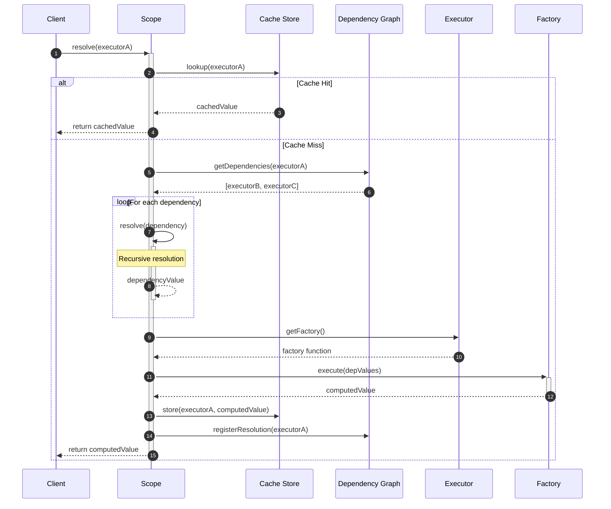
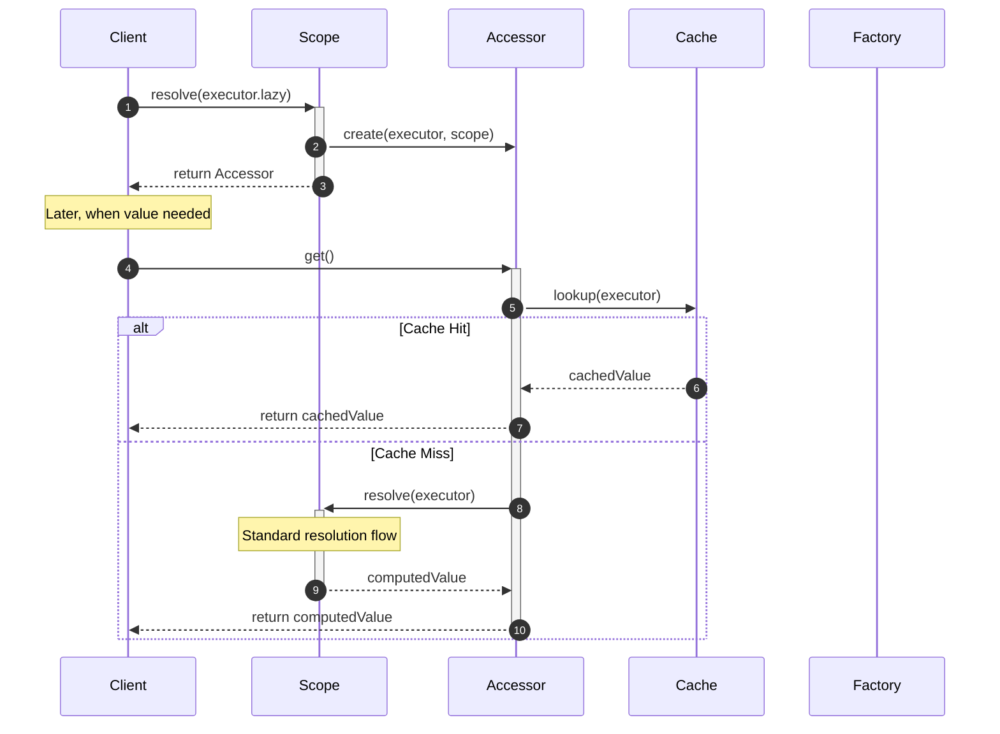
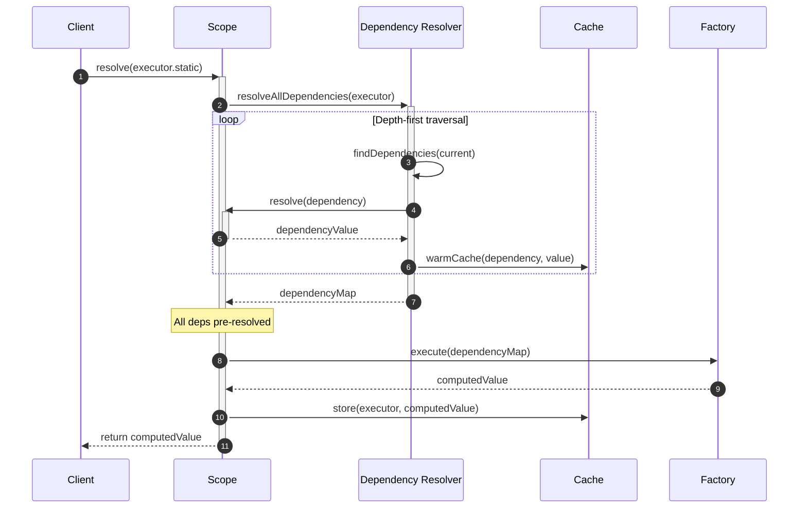
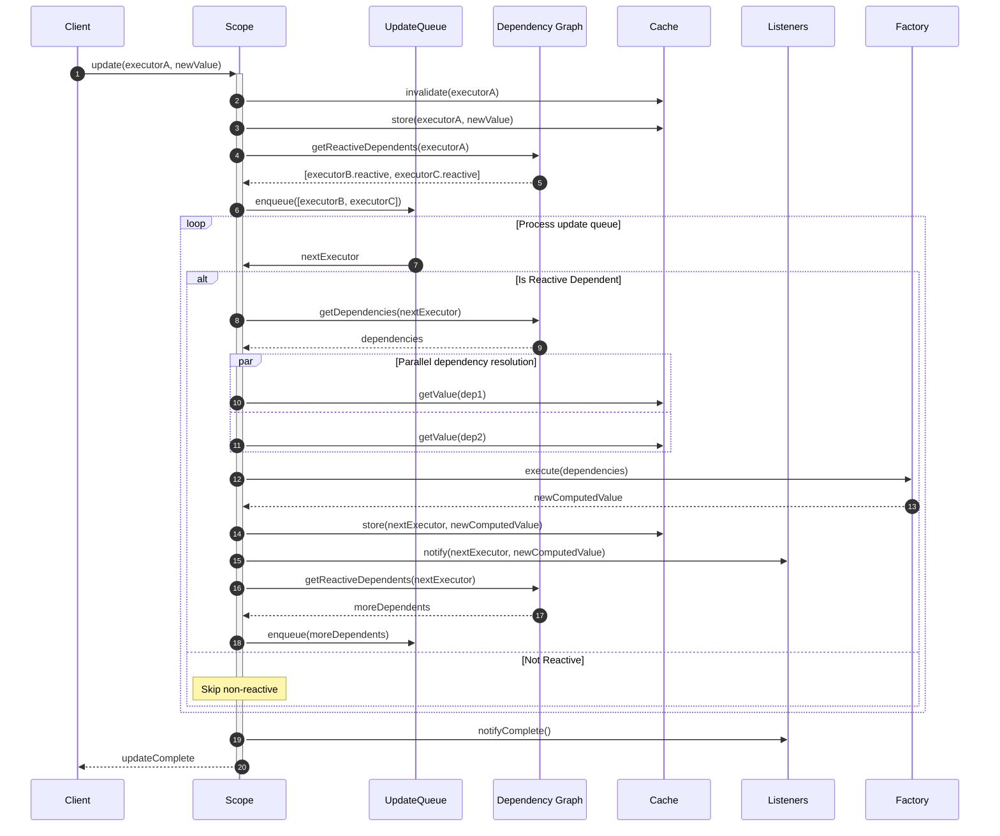
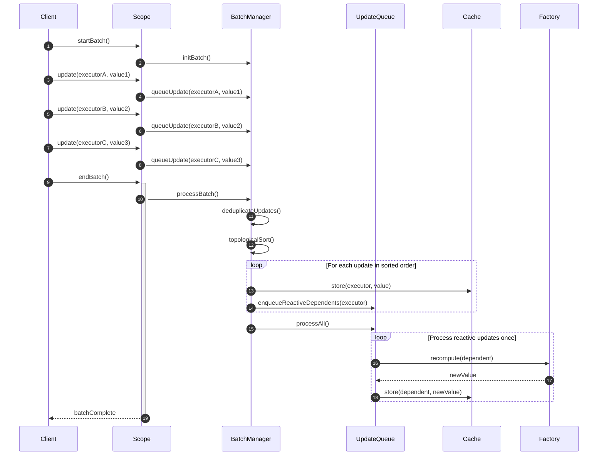
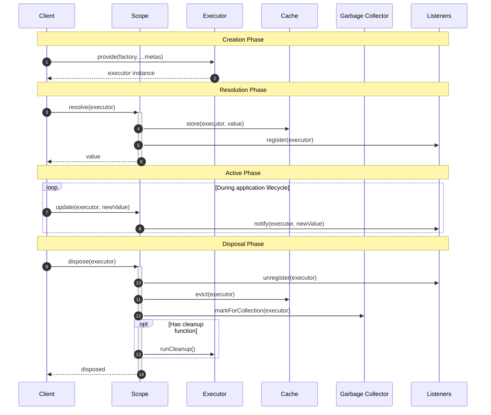
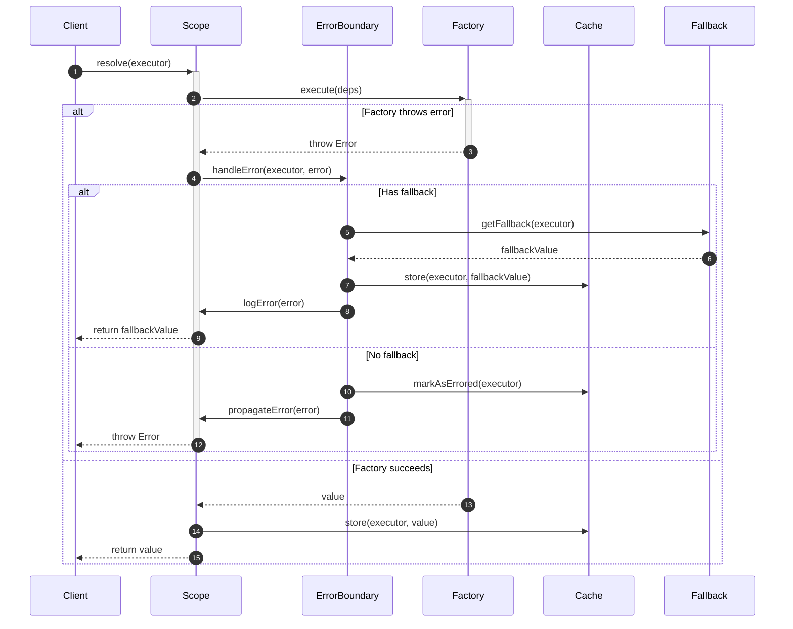
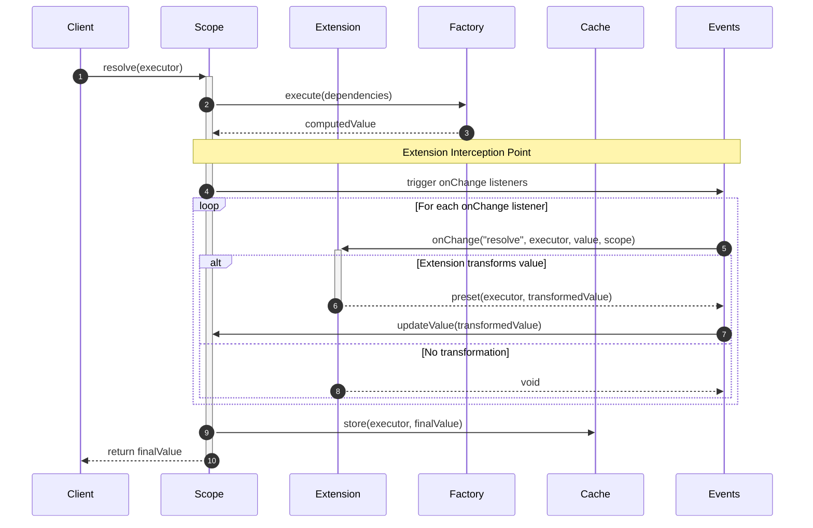
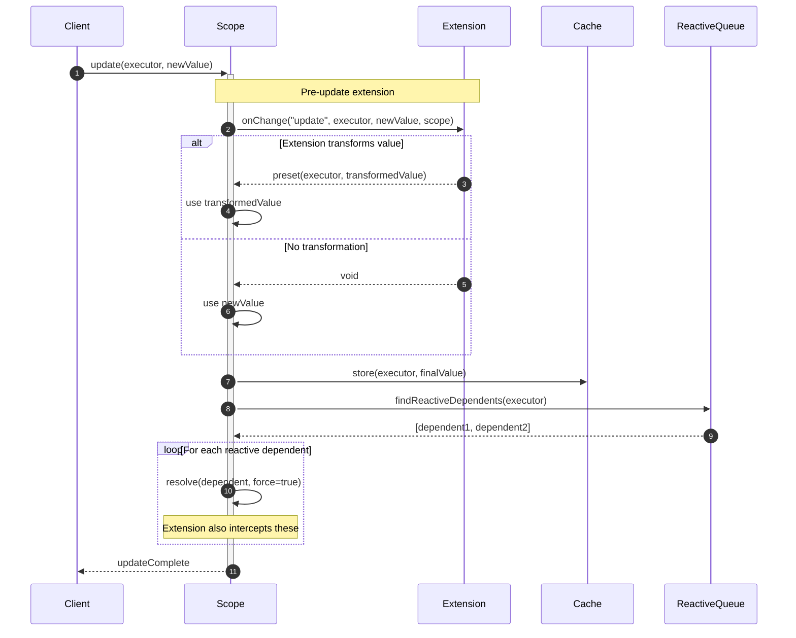
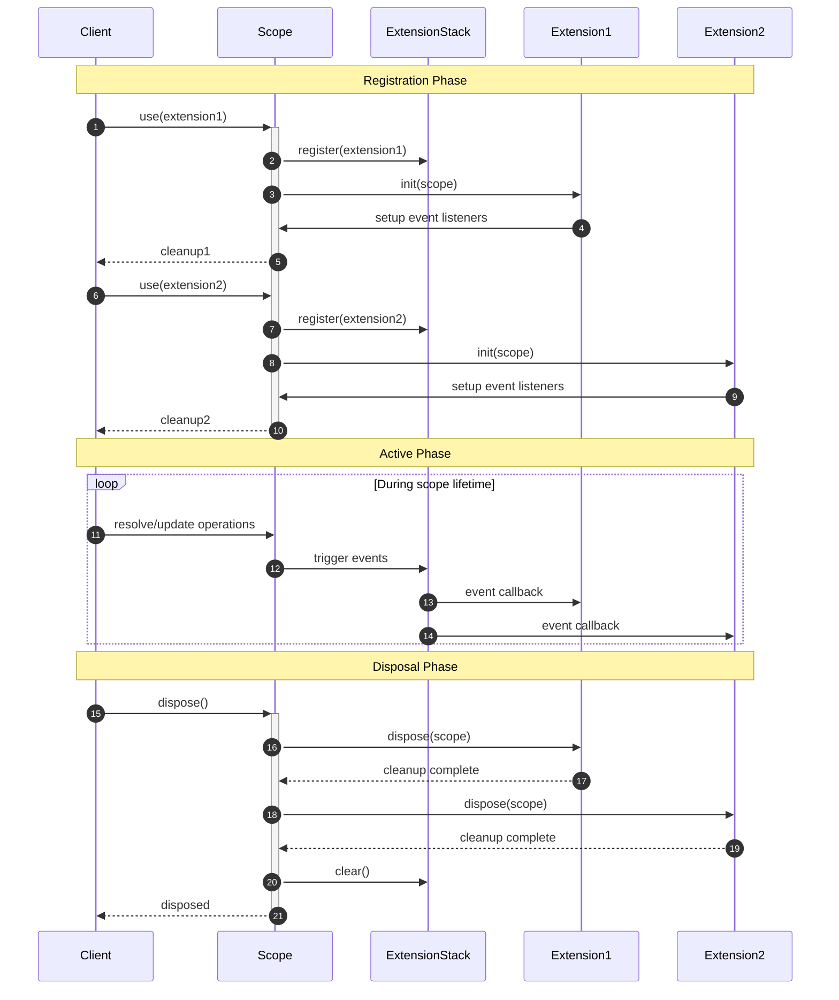

# Graph Resolution Fundamentals

`@pumped-fn/core-next` implements graph-based dependency resolution - a paradigm that transforms how you build and organize applications.

## Core Principles

### 1. Dependency Graph Structure
Every application is a graph of dependencies. Instead of manually wiring components, you define the graph structure and let the library resolve it:

```typescript
// Define the graph nodes
const config = provide(() => loadConfig())
const logger = derive([config], ([cfg]) => createLogger(cfg.logLevel))
const db = derive([config, logger], ([cfg, log]) => connectDB(cfg.database, log))
const app = derive([db, logger], ([database, log]) => createApp(database, log))

// Resolve the entire graph with one call
const resolvedApp = await scope.resolve(app)
```

### 2. Automatic Resolution Order
The library topologically sorts dependencies and resolves them in the correct order:
- `config` resolves first (no dependencies)
- `logger` resolves second (depends on `config`)
- `db` resolves third (depends on `config` and `logger`)
- `app` resolves last (depends on `db` and `logger`)

### 3. Singleton Caching
Each executor resolves exactly once per scope. Multiple dependents share the same resolved instance:

```typescript
const sharedConfig = provide(() => expensiveConfigLoad())
const serviceA = derive([sharedConfig], ([cfg]) => createServiceA(cfg))
const serviceB = derive([sharedConfig], ([cfg]) => createServiceB(cfg))

// sharedConfig resolves only once, both services get same instance
await scope.resolve([serviceA, serviceB])
```

### 4. Lazy Evaluation
Graph nodes only resolve when needed, enabling conditional dependencies and performance optimization:

```typescript
const expensiveService = provide(() => createExpensiveService())
const conditionalFeature = derive([config, expensiveService.lazy], ([cfg, lazy]) => {
  if (cfg.enableFeature) {
    return lazy.get() // Only resolves expensiveService if needed
  }
  return null
})
```

## Graph vs Traditional Patterns

### Traditional Approach Problems
```typescript
// Manual dependency management - error prone
class Application {
  constructor() {
    this.config = new Config()           // Order matters
    this.logger = new Logger(this.config) // Must come after config
    this.db = new DB(this.config, this.logger) // Must come after both
    this.api = new API(this.db, this.logger)   // Must come last
  }
}

// Testing requires complex mocking
const mockConfig = { test: true }
const mockLogger = { log: jest.fn() }
const mockDB = { query: jest.fn() }
const app = new Application()
// How do you inject the mocks?
```

### Graph Resolution Solution
```typescript
// Dependencies declared where they're used
const config = provide(() => loadConfig())
const logger = derive([config], ([cfg]) => createLogger(cfg))
const db = derive([config, logger], ([cfg, log]) => connectDB(cfg, log))
const api = derive([db, logger], ([database, log]) => createAPI(database, log))

// Testing: replace any node, entire graph adapts
const testScope = createScope(preset(config, { test: true }))
const result = await testScope.resolve(api) // Uses test config throughout
```

## Primitives

### executors

Executor is the atom of `pumped-fn`. At its heart, it's measely an object to be used as a reference. It contains the factory function, dependencies and metas

Executor has a few references used as signal the scope to treat the graph of dependencies slightly differently

- `lazy` is a representation of an Executor at the Scope. It gives you the access to the Accessor. It fuels conditional dependency, lazy evalution
- `reactive` is a Reactive indicator of an Executor at the Scope. When a value depending on a reactive variation, whenever the main Executor got updated, the factory will be triggered
- `static` is a static representation of an Executor at the Scope. Similar to .lazy, the major different is `static` will also resolve the dependency graph prior to triggering the factory

### scope

Scope is the **graph actualizer** - the engine responsible for traversing and resolving dependency graphs. When you call `scope.resolve(executor)`, the scope:

1. **Analyzes the dependency graph**: Recursively discovers all dependencies of the target executor
2. **Determines resolution order**: Uses topological sorting to resolve dependencies in correct sequence
3. **Caches resolved values**: Each executor resolves exactly once per scope, with results cached for reuse
4. **Manages lifecycle**: Tracks resolved executors and handles cleanup on disposal

Each scope is isolated with its own dependency graph cache and lifecycle. Applications typically use one long-running scope for shared resources, though multiple scopes are supported for specific use cases.

**Key insight**: Scope transforms declarative dependency definitions into imperative resolution sequences, making dependency injection automatic rather than manual.

### pod

Pod is an isolated sub-scope forked from a parent scope, designed for short-span operations like individual request handling or temporary computations. Pods inherit the parent scope's resolved values but maintain their own local cache. Changes within a pod don't affect the parent scope, ensuring isolation between concurrent operations.

Key characteristics:
- **Inheritance**: Copies resolved values from parent scope at creation time
- **Isolation**: Local changes don't propagate back to parent scope
- **Lifecycle**: Automatically disposed when operation completes or manually released
- **Performance**: Avoids re-resolving already computed dependencies from parent

### flow

Flow is the unit that supports short-span operations with structured business logic. Each flow execution creates a pod (forked scope) and maintains a root context (map-like data structure). Flows can execute sub-flows recursively, with each sub-execution creating a forked version of the root context for data isolation.

Relationship between concepts:
- **Scope**: Long-running container for shared resources (database connections, services)
- **Pod**: Short-lived fork of scope for isolated operations
- **Flow**: Business logic execution unit that uses pods for dependency resolution

### meta

Meta is the decorative information system that allows attaching typed metadata to executors, scopes, pods, and flows. Meta serves multiple purposes:

- **Executor decoration**: Attach configuration, debug information, or behavioral hints to executors
- **Scope configuration**: Pass configuration to resources and extensions at scope level
- **Pod/Flow configuration**: Configure execution behavior and pass data to extensions
- **Extension integration**: Extensions can read meta information to modify behavior

Meta uses a strongly-typed system where each piece of metadata is identified by a unique symbol or string key with associated type information.

### preset

Preset is the mechanism for overriding executor values, primarily used for testing and environment configuration. Presets allow you to:

- **Replace implementations**: Substitute real services with mocks for testing
- **Environment switching**: Use different configurations for development, testing, production
- **Value injection**: Inject specific values into the dependency graph without changing code

Presets are applied at scope creation time and affect the entire dependency graph resolution.

### extensions

Extensions provide a powerful event-driven system for intercepting and modifying the executor resolution pipeline. They operate through event hooks that are triggered during resolution, update, and release operations.

The extension system consists of:
- **Extension Interface**: `init` and `dispose` lifecycle hooks
- **Event Callbacks**: `onChange` for resolve/update events, `onRelease` for cleanup
- **Value Transformation**: Return `preset()` to override resolved/updated values
- **Cross-cutting concerns**: Implement aspects like logging, metrics, transaction management across the entire graph

## resolution flow

### standard resolution



### lazy resolution



### static resolution with dependency pre-resolution



## update flow

### reactive update propagation



### batch update optimization



## executor lifecycle management



## error handling and recovery



## extension flow

### extension interception during resolution



### extension during update propagation



### extension lifecycle management



### lifecycle
