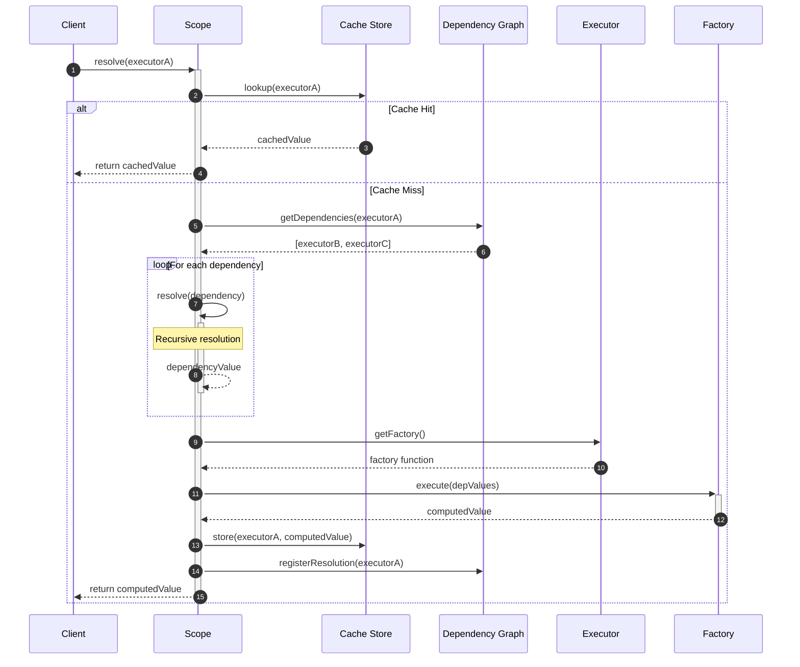
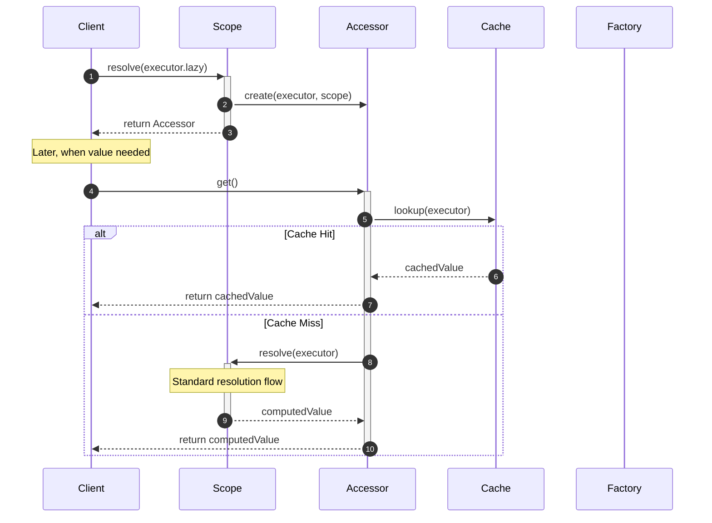
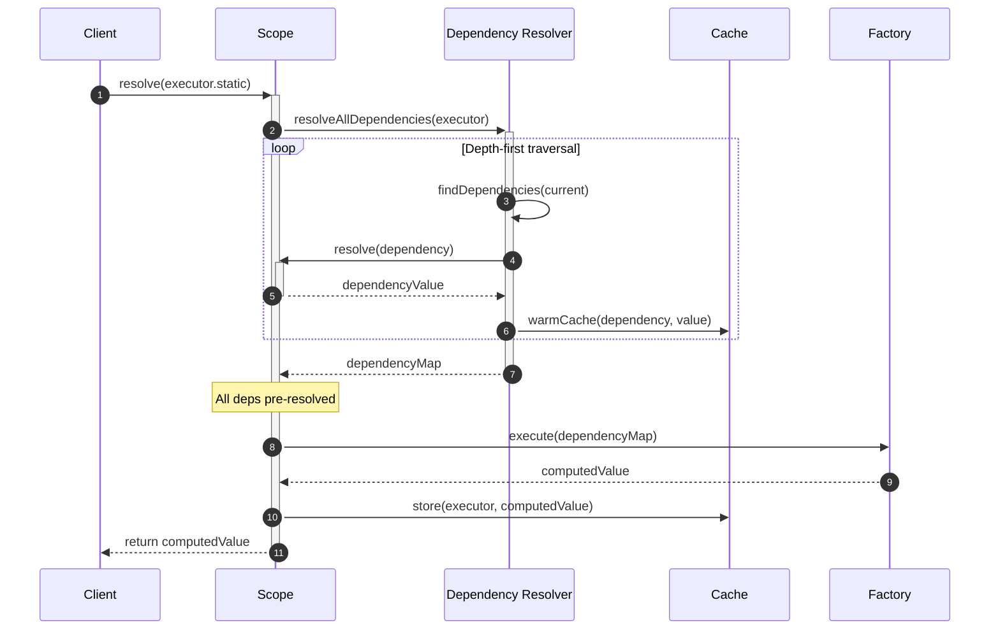
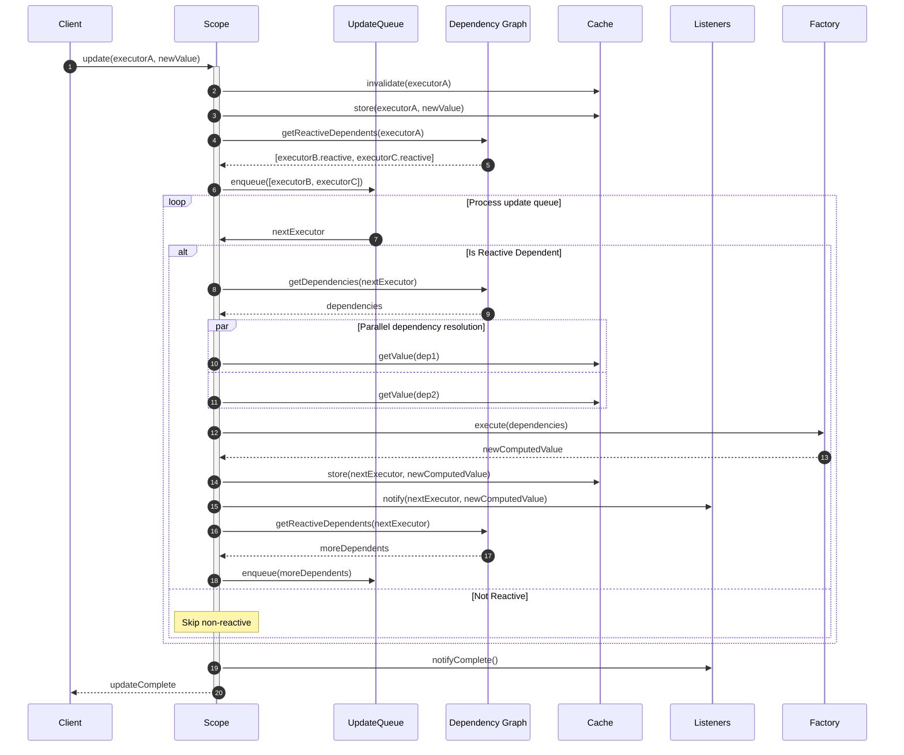
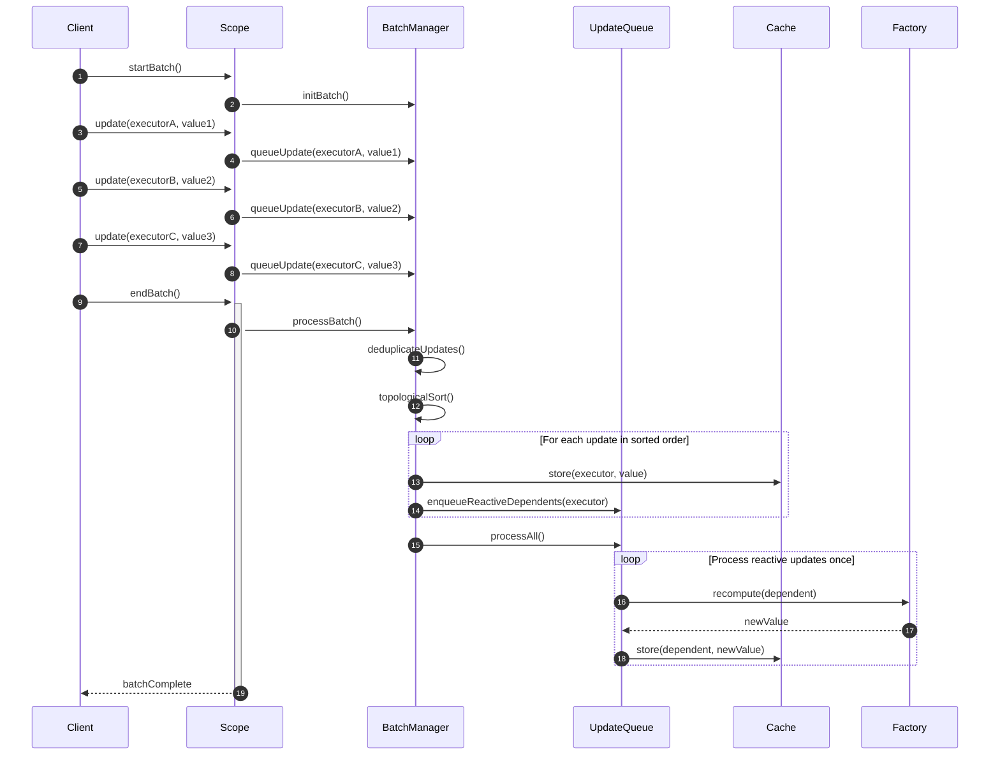
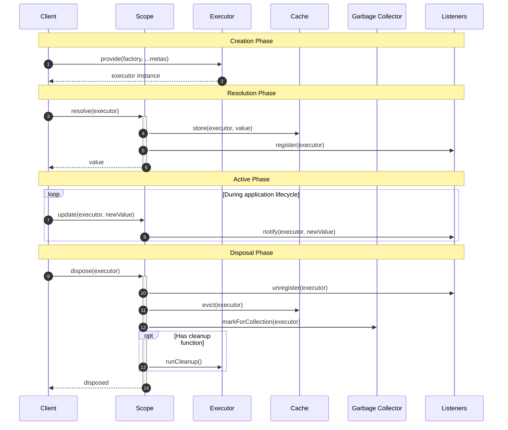
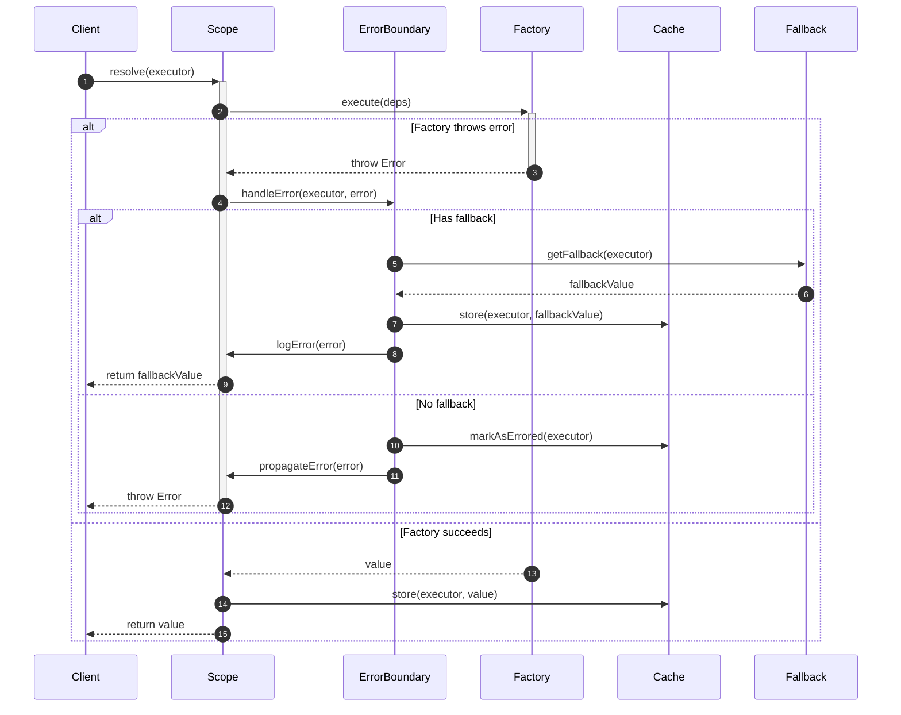

# introduction

`@pumped-fn/core-next` tried its best to stay on very low amount of APIs, it makes programming fun, ease on importing and also LLM-friendly

## primitives

### executors

Executor is the atom of `pumped-fn`. At its heart, it's measely an object to be used as a reference. It contains the factory function, dependencies and metas

Executor has a few references used as signal the scope to treat the graph of dependencies slightly differently

- `lazy` is a representation of an Executor at the Scope. It gives you the access to the Accessor. It fuels conditional dependency, lazy evalution
- `reactive` is a Reactive indicator of an Executor at the Scope. When a value depending on a reactive variation, whenever the main Executor got updated, the factory will be triggered
- `static` is a static representation of an Executor at the Scope. Similar to .lazy, the major different is `static` will also resolve the dependency graph prior to triggering the factory

### scope

Scope is a container. Each scope is isolated, and has its own lifecycle, and can be applied using different middlewares. An application can have as many scope as it wants, despite most of them actually requires only one

Scope only know about the Executors which `resolve` by it, as such the dependency graph is local to a scope.

## resolution flow

### standard resolution

### lazy resolution

### static resolution with dependency pre-resolution

## update flow

### reactive update propagation

### batch update optimization

## executor lifecycle management

## error handling and recovery

### lifecycle
