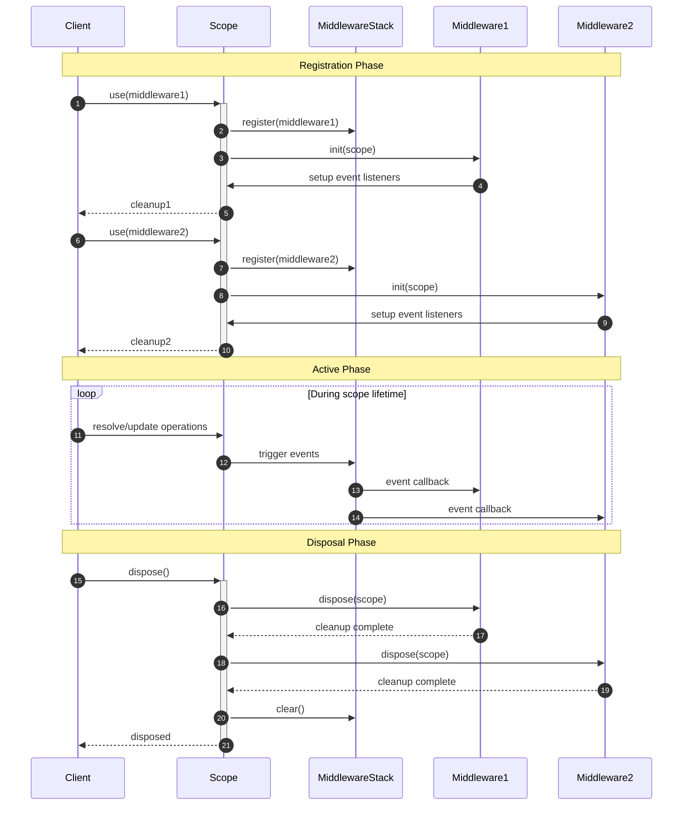

# Graph Resolution Fundamentals

`@pumped-fn/core-next` implements graph-based dependency resolution - a paradigm that transforms how you build and organize applications.

## Core Principles

### 1. Dependency Graph Structure
Every application is a graph of dependencies. Instead of manually wiring components, you define the graph structure and let the library resolve it:

```typescript
// Define the graph nodes
const config = provide(() => loadConfig())
const logger = derive([config], ([cfg]) => createLogger(cfg.logLevel))
const db = derive([config, logger], ([cfg, log]) => connectDB(cfg.database, log))
const app = derive([db, logger], ([database, log]) => createApp(database, log))

// Resolve the entire graph with one call
const resolvedApp = await scope.resolve(app)
```

### 2. Automatic Resolution Order
The library topologically sorts dependencies and resolves them in the correct order:
- `config` resolves first (no dependencies)
- `logger` resolves second (depends on `config`)
- `db` resolves third (depends on `config` and `logger`)
- `app` resolves last (depends on `db` and `logger`)

### 3. Singleton Caching
Each executor resolves exactly once per scope. Multiple dependents share the same resolved instance:

```typescript
const sharedConfig = provide(() => expensiveConfigLoad())
const serviceA = derive([sharedConfig], ([cfg]) => createServiceA(cfg))
const serviceB = derive([sharedConfig], ([cfg]) => createServiceB(cfg))

// sharedConfig resolves only once, both services get same instance
await scope.resolve([serviceA, serviceB])
```

### 4. Lazy Evaluation
Graph nodes only resolve when needed, enabling conditional dependencies and performance optimization:

```typescript
const expensiveService = provide(() => createExpensiveService())
const conditionalFeature = derive([config, expensiveService.lazy], ([cfg, lazy]) => {
  if (cfg.enableFeature) {
    return lazy.get() // Only resolves expensiveService if needed
  }
  return null
})
```

## Graph vs Traditional Patterns

### Traditional Approach Problems
```typescript
// Manual dependency management - error prone
class Application {
  constructor() {
    this.config = new Config()           // Order matters
    this.logger = new Logger(this.config) // Must come after config
    this.db = new DB(this.config, this.logger) // Must come after both
    this.api = new API(this.db, this.logger)   // Must come last
  }
}

// Testing requires complex mocking
const mockConfig = { test: true }
const mockLogger = { log: jest.fn() }
const mockDB = { query: jest.fn() }
const app = new Application()
// How do you inject the mocks?
```

### Graph Resolution Solution
```typescript
// Dependencies declared where they're used
const config = provide(() => loadConfig())
const logger = derive([config], ([cfg]) => createLogger(cfg))
const db = derive([config, logger], ([cfg, log]) => connectDB(cfg, log))
const api = derive([db, logger], ([database, log]) => createAPI(database, log))

// Testing: replace any node, entire graph adapts
const testScope = createScope(preset(config, { test: true }))
const result = await testScope.resolve(api) // Uses test config throughout
```

## Primitives

### executors

Executor is the atom of `pumped-fn`. At its heart, it's measely an object to be used as a reference. It contains the factory function, dependencies and metas

Executor has a few references used as signal the scope to treat the graph of dependencies slightly differently

- `lazy` is a representation of an Executor at the Scope. It gives you the access to the Accessor. It fuels conditional dependency, lazy evalution
- `reactive` is a Reactive indicator of an Executor at the Scope. When a value depending on a reactive variation, whenever the main Executor got updated, the factory will be triggered
- `static` is a static representation of an Executor at the Scope. Similar to .lazy, the major different is `static` will also resolve the dependency graph prior to triggering the factory

### scope

Scope is a container. Each scope is isolated, and has its own lifecycle, and can be applied using different plugins. An application can have as many scope as it wants, despite most of them actually requires only one

Scope only know about the Executors which `resolve` by it, as such the dependency graph is local to a scope.

### plugins

Plugins provide a powerful event-driven system for intercepting and modifying the executor resolution pipeline. They operate through event hooks that are triggered during resolution, update, and release operations.

The plugin system consists of:
- **Plugin Interface**: `init` and `dispose` lifecycle hooks
- **Event Callbacks**: `onChange` for resolve/update events, `onRelease` for cleanup
- **Value Transformation**: Return `preset()` to override resolved/updated values

## resolution flow

### standard resolution


### lazy resolution


### static resolution with dependency pre-resolution


## update flow

### reactive update propagation


### batch update optimization


## executor lifecycle management


## error handling and recovery


## middleware flow

### middleware interception during resolution


### middleware during update propagation


### middleware lifecycle management



### lifecycle
